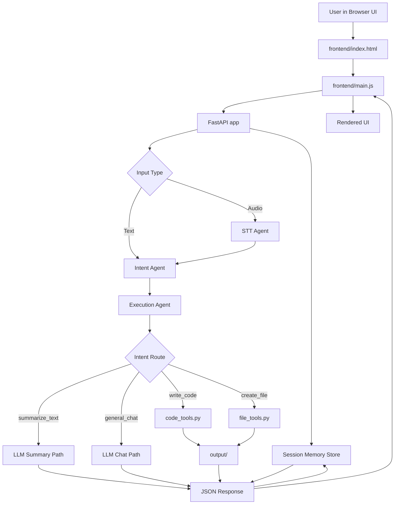

# VOXA Flow Diagram

This document describes how the frontend, backend, and agents work together.

## Flow Diagram

## Endpoint Summary

- `GET /` serves the main page
- `GET /frontend/*` serves frontend assets
- `GET /health` reports backend status
- `POST /process/audio` handles audio uploads and STT
- `POST /process/text` handles direct text input
- `GET /output/files` lists generated files
- `GET /output/*` serves generated output files

## Notes

- Audio requests go through STT before intent classification.
- Text requests start directly at the intent agent.
- The frontend renders a single structured response from the backend pipeline.
- Session memory is stored in-memory per browser session and is reused for context-aware chat and summarization.
